# PRODUCTION RUNWAY — Raspberry Rum Studio Plan

> *A 2-person indie team, post-GDC, building a vertical slice that needs to sing. This is the production plan that gets Iris from prototype to release.*

---

## Table of Contents

1. [Executive Summary](#1-executive-summary)
2. [Team Structure & Roles](#2-team-structure--roles)
3. [Project Status](#3-project-status)
4. [Current Sprint & Upcoming Work](#4-current-sprint--upcoming-work)
5. [Content & Narrative Pipeline](#5-content--narrative-pipeline)
6. [GDC 2026 Outcomes](#6-gdc-2026-outcomes)
7. [Funding & Grants](#7-funding--grants)
8. [Press Kit & Public Presence](#8-press-kit--public-presence)
9. [Steam Store Page](#9-steam-store-page)
10. [Feedback & Playtesting](#10-feedback--playtesting)
11. [Risk Analysis](#11-risk-analysis)
12. [Master Timeline](#12-master-timeline)

---

## 1. Executive Summary

Raspberry Rum is a **2-person studio** building Iris, a contemplative dating-sim-meets-horror game in **Unity 6 (URP)**. The prototype now has **30+ working systems** across **20,000+ lines** of production-quality code scoring **8/10** on a technical audit. **GDC 2026 is complete** (March 9–13) — pitch materials were prepared and publisher conversations initiated. The codebase has seen **massive development** since February: main menu, tutorial, name entry, outfit selection, entrance judgment sequence, drink delivery system, flower-to-apartment integration, calendar, keyword highlighting, moment camera, PSX rendering suite, item pairing, visibility indicators, save system, accessibility suite, and extensive polish. **6 of 9 vertical-slice-critical systems** are now built. The remaining runway covers **completing the vertical slice** (Phase 2/3 date flow polish, horror payload, convention demo mode), **grant applications** (Epic MegaGrants opens June 29), a **Steam "Coming Soon" page** target for May 2026, and continued content production.

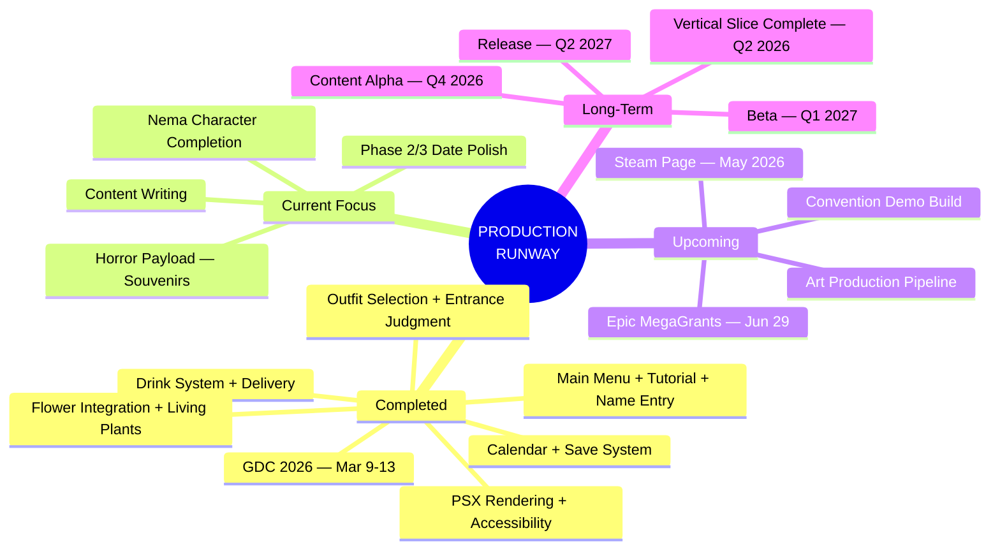

---

## 2. Team Structure & Roles

Raspberry Rum is a **2-person team** with shared creative authority. Every decision — from art direction to music selection — is collaborative. Production roles split by craft.

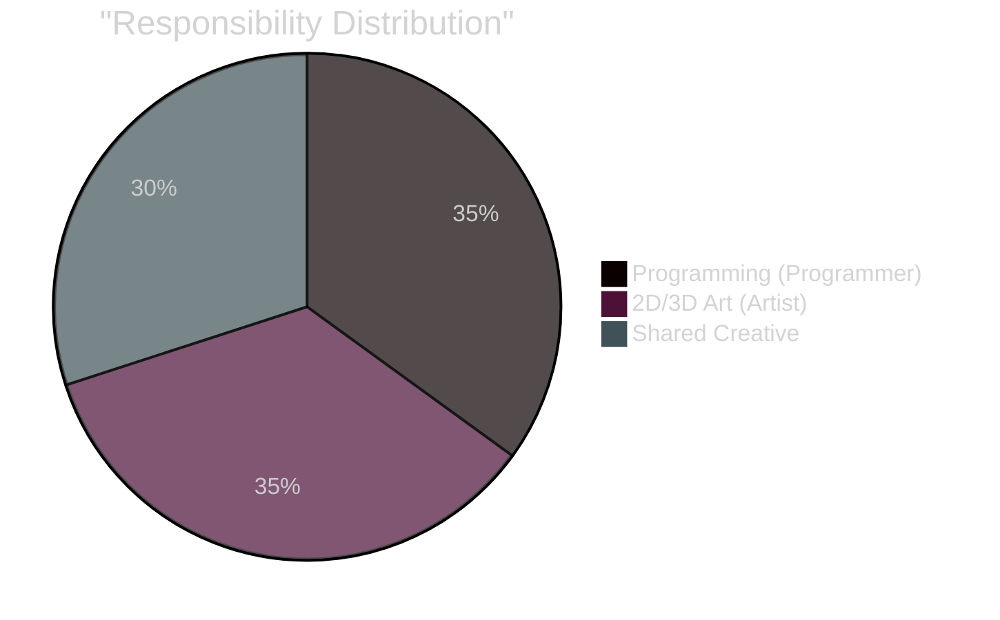

| Domain | Owner | Scope |
|--------|:-----:|-------|
| **Code & Systems** | Programmer | All C#, Unity pipeline, scene builders, integration, tools |
| **2D/3D Art** | Artist | Modeling, texturing, UI art, visual polish, capsule art |
| **Creative Direction** | Both | Game feel, tone, narrative voice, visual direction |
| **Art Direction** | Both | Color palettes, mood boards, asset style targets |
| **Narrative Design** | Both | Nema backstory, date characters, mess narratives, dialogue |
| **Music Selection** | Both | Curating records, ambient tracks, mood-appropriate audio |
| **Business & Marketing** | Both | GDC, grants, press kit, social media, Steam page |
| **Playtesting** | Both | System verification, UX feedback, convention demos |

---

## 3. Project Status

**30+ systems built and working.** The codebase is production-quality at **8/10** with full event-driven architecture, ScriptableObject data pipeline, and 14+ completed development phases. **3 vertical-slice-critical systems** remain unbuilt.

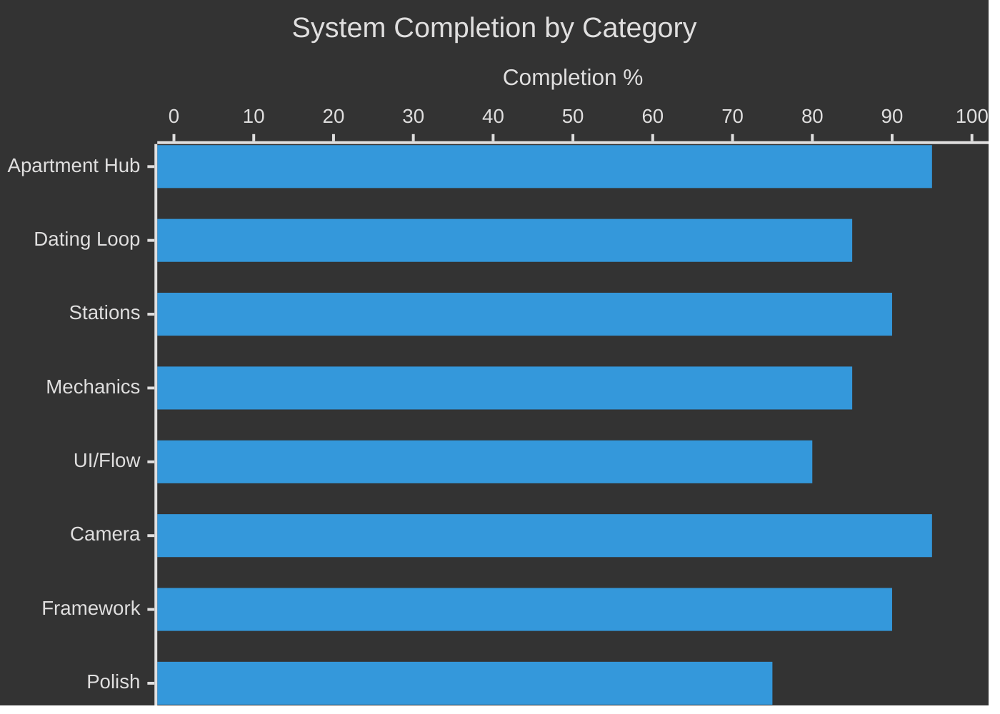

### Core Systems

| System | Status | Completion | Notes |
|--------|--------|:----------:|-------|
| **Apartment Hub** (3 areas, spline dolly) | Complete | 95% | Browsing, stations, grab/place, highlights, edge scroll |
| **Dating Loop** (3-phase, NavMesh NPC) | Complete | 85% | Phase 1 done, Phase 2 reworked, Phase 3 needs polish |
| **Bookcase Station** (books, perfume, drawers) | Complete | 95% | 15 books, 5 coffee table books, 3 perfumes, cubby capacity |
| **Drink Making** (bottle pour + delivery) | Complete | 90% | Phase 2 gating, magnetic snap, delivery to date, proximity click |
| **Cleaning** (sponge wipe) | Complete | 90% | Stubbornness removed, sponge-only for now |
| **Record Player** (vinyl workflow) | Complete | 95% | Physical extract/carry/snap/play, album art, MoodMachine |
| **MoodMachine** (atmosphere) | Complete | 95% | Light, ambient, fog, rain, weather timelines |
| **Camera Presets** (A/B/C) | Complete | 95% | LensSettings, VolumeProfile, editor gizmos, tilt-shift |
| **Game Clock** (7-day calendar) | Complete | 85% | Analog clock with pivot hands, calendar UI |
| **Flower Trimming** | Complete | 95% | Virtual cut, scoring, grading, music, 5x zoom, phase title |
| **Watering System** | Complete | 90% | Physical can, 2D cross-section, pour persistence, weather drying |
| **Main Menu** | Complete | 95% | 3-panel FSM, Nema parallax, text dissolve buttons |
| **Tutorial Card** | Complete | 95% | Overlay with control instructions |
| **Name Entry** | Complete | 90% | Earthbound-style letter grid, save-aware |
| **Outfit Selection** | Complete | 90% | OutfitSelector, date judges in Phase 1 |
| **Entrance Judgment** | Complete | 90% | 4 sequential judgments (outfit, perfume, welcome, cleanliness) |
| **Flower Integration** | Complete | 95% | Bridge loads scene, captures result, spawns living plant |
| **Calendar** | Complete | 90% | Clickable 7-day grid, date history, flower grades |
| **Save System** | Complete | 85% | IrisSaveData: day, history, plants, layout. Auto-save on quit/date |
| **PSX Rendering** | Complete | 95% | Vertex snap, affine, dithering, per-object overrides, NatureBox sky |
| **Accessibility** | Complete | 95% | 15 settings, 5 categories, tabbed panel, captions, text theme |
| **Keyword Highlighting** | Complete | 95% | Per-category shimmer on TMP text across all UI |
| **Moment Camera** | Complete | 90% | Auto-frames events, lateral slide, optional FOV |
| **Item Pairing** | Complete | 90% | Shoes side-by-side, dishes stacked, partner highlight |
| **Visibility Eyes** | Complete | 90% | World-space open/closed icons, flash at exploration start |
| **Feedback Tools** | Complete | 95% | F8 playtest + F9 bug report, Discord webhooks |
| **Pre-spawned Mess** | Complete | 85% | DailyMessSpawner, flower-condition mess blueprints |
| **Nema Character** | Partial | 50% | Phase models exist, wellbeing/personality charts, voice lines. Missing: full idle animations, contextual behaviors |
| **Couch Win Scene** | Not Started | 0% | VS-Critical |
| **Convention Demo Mode** (7 min) | Not Started | 0% | Demo-Critical |
| **Date Disappearance / Souvenirs** | Not Started | 0% | VS-Critical — horror payload |

### Apartment Stations (10+)

| # | Station | Interaction | Status |
|:-:|---------|-------------|:------:|
| 1 | **Trashcan** | Throw away trash/bottles | Working |
| 2 | **Dishwasher / Sink Zone** | Load dirty dishes, dirty glass system | Working |
| 3 | **Refrigerator / Drink Cart** | Drink making (pour, deliver) | Working |
| 4 | **Plants** | Watering (drag-to-pour) | Working |
| 5 | **Record Player** | Browse/play vinyl, album art | Working |
| 6 | **Perfume** | One-click spray (mood/scent) | Working |
| 7 | **Bookcase** | Browse/read/inspect, cubby storage | Working |
| 8 | **Coffee Table** | Place book/deliver drink | Working |
| 9 | **Phone** | Call date, ambient clickable | Working |
| 10 | **Analog Clock** | Physical clock with pivot hands | Working |
| 11 | **Outfit Closet** | Select outfit for date | Working |
| 12 | **Door / Entrance** | Shoe rack, coat rack, DropZones | Working |

---

## 4. Current Sprint & Upcoming Work

Development has shifted from broad system building to **vertical slice completion** and **content polish**.

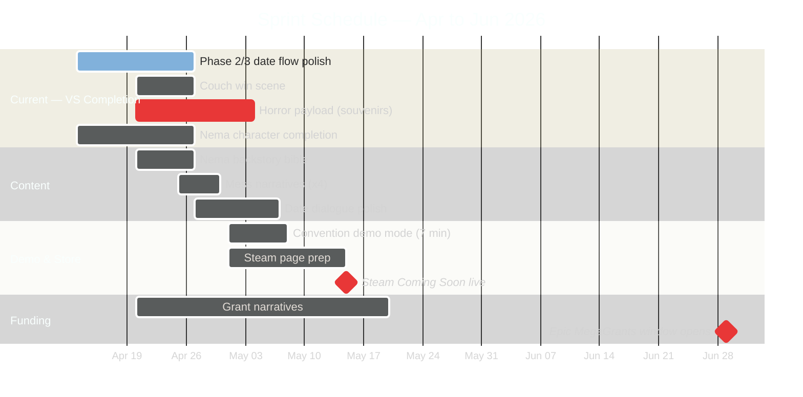

### Immediate Priorities (April 13–27)

| # | Task | Blocking? | Notes |
|:-:|------|:---------:|-------|
| 1 | **Phase 2/3 date flow polish** | VS-Critical | Drink delivery working, needs conversation/reaction polish |
| 2 | **Nema character completion** | VS-High | Phase models exist, need idle animations + contextual behavior |
| 3 | **Couch win scene** | VS-Critical | Post-successful-date cinematic |
| 4 | **Horror payload — date disappearance + souvenirs** | VS-Critical | Core identity of the game |
| 5 | **Content writing — Nema bible + mess narratives** | VS-High | Drives dialogue, environmental storytelling |

### Next Sprint (April 28 – May 15)

| # | Task | Notes |
|:-:|------|-------|
| 1 | **Convention demo mode** | 7-minute curated slice with timer |
| 2 | **Steam page preparation** | Capsule art, screenshots, descriptions |
| 3 | **Date dialogue & conversation polish** | Per-character, per-phase dialogue trees |
| 4 | **Art asset integration pass** | Replace remaining programmer art |
| 5 | **Audio asset integration pass** | Wire SFX + music from asset list |

---

## 5. Content & Narrative Pipeline

Two critical writing deliverables remain: the **Nema character bible** and **mess narratives**. Both drive downstream systems — dialogue, environmental storytelling, stain spawning, and date reactions.

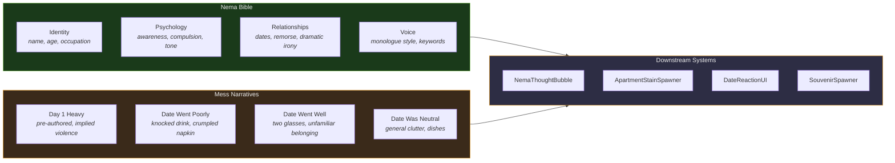

### Nema Character Bible

| Element | Question to Answer | Informs |
|---------|-------------------|---------|
| **Full name & age** | Who is Nema on the surface? | UI, dialogue, press kit |
| **Occupation / cover** | What does the world think she does? | Apartment decor, mail content |
| **Apartment history** | How long here? Why this apartment? | Environmental detail density |
| **Flower relationship** | Therapeutic? Obsessive? Ritual? | Flower trimming tone, tutorial text |
| **Serial killer layer** | Compulsive? Deliberate? Dissociative? | Horror escalation curve |
| **Monologue tone** | Chipper? Deadpan? Anxious? Detached? | NemaThoughtBubble text style |
| **Date relationships** | Genuine affection? Manipulation? Loneliness? | Dialogue, reaction bridge text |
| **Player vs. Nema knowledge** | What dramatic irony exists? | When/how horror reveals land |

**Deliverable:** `NEMA_BIBLE.md` — **1-2 pages**, referenced by all content decisions.

### Mess Narratives

Each mess scenario defines stain activation, scattered objects, and Nema's morning internal monologue.

| Scenario | Stain Slots | Scattered Objects | Nema's Thought |
|----------|:-----------:|:-----------------:|---------------|
| **Day 1 Heavy** | 6-8 of 8 | Wine bottle, broken glass, damp towel, half-eaten food | *"Last night was... a lot."* |
| **Date Went Poorly** | 2-3 | Knocked drink, untouched appetizer, crumpled napkin | *"They didn't even finish their drink."* |
| **Date Went Well** | 3-4 | Two wine glasses, unfamiliar belonging, faint perfume | *"Where did they go?"* |
| **Date Was Neutral** | 1-2 | Dishes in sink, empty bottles, couch cushion displaced | *"Another Tuesday."* |

**Deliverable:** `MESS_NARRATIVES.md` — **4 scenarios** minimum, each with stain map, object list, and thought text.

---

## 6. GDC 2026 Outcomes

**GDC ran March 9–13** at Moscone Center, San Francisco. Pitch materials were prepared including a 10–15 slide deck, elevator pitch, and demo build.

### Post-GDC Action Items

| Item | Status | Deadline |
|------|:------:|:--------:|
| Follow-up emails to contacts | Pending | Within 2 weeks of GDC |
| Send builds to interested parties | Pending | As requested |
| Post GDC recap (social + devlog) | Pending | — |
| Update pitch deck with GDC feedback | Done | Updated April 2026 |
| Incorporate publisher feedback into roadmap | In Progress | Ongoing |

### Publisher Targets (Original List)

| Publisher | Why They Fit Iris | Status |
|-----------|------------------|:------:|
| **Annapurna Interactive** | Narrative-driven, emotionally complex, horror-adjacent | Track |
| **Devolver Digital** | Weird, bold, creative-first, indie champion | Track |
| **Fellow Traveller** | Narrative games specialist, small team friendly | Track |
| **Finji** | Intimate stories, 2-person team empathy | Track |
| **Raw Fury** | Creative freedom, diverse portfolio | Track |
| **Armor Games Studios** | Small-scope narrative, unique mechanics | Track |
| **Serenity Forge** | Story-driven, emotional, polished indie | Track |
| **Akupara Games** | Narrative indie, accessible price points | Track |

### Platform Holder Programs

| Program | What They Offer | Status |
|---------|----------------|:------:|
| **Xbox ID@Xbox** | Free dev kits, store featuring, Game Pass potential | Research |
| **PlayStation Indies** | Indie spotlight, store visibility, dev support | Research |
| **Nintendo Indie World** | Showcase slots, eShop featuring | Research |
| **Steam / Valve** | Visibility rounds, store page optimization guidance | Active |

---

## 7. Funding & Grants

**8 funding sources** identified. Epic MegaGrants window opens **June 29**. Grant narratives should reuse pitch deck content.

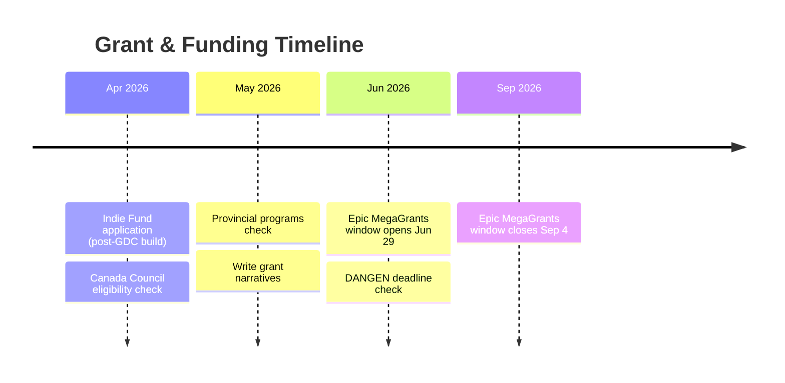

| Opportunity | Amount | Window | Requirements | Fit |
|-------------|:------:|--------|-------------|:---:|
| **Epic MegaGrants** | **$5K-$500K** | Jun 29 — Sep 4, 2026 | Using Unreal OR enhancing open source (Unity may qualify under community) | Medium |
| **Indie Fund** | Investment | Rolling | Playable build, clear vision, small team | High |
| **DANGEN Entertainment** | **$50K** pool | Check deadline | Playable PC build, clear art direction, micro gameplay loop | High |
| **Canada Council — Explore & Create** | Varies | Rolling | Canadian applicant, artistic merit | Check |
| **Canada Media Fund** | Varies | Provincial | Canadian studio, creative IP | Check |
| **Ontario Creates** | Varies | Program-specific | Ontario-based company | Check |
| **Weird Ghosts** | Mentorship + $$ | Cohort-based | Women & marginalized founders in Canada | Check |
| **Unity for Humanity** | **$25K** | Annual | Social impact angle | Low |

### Budget Framework (For Grant Applications)

| Category | Estimated Need | What It Covers |
|----------|:--------------:|---------------|
| **Art production** | **$15-25K** | Character models, animations, environment art, UI |
| **Audio / music** | **$5-10K** | Original soundtrack, SFX library, voice (if any) |
| **Marketing** | **$3-5K** | Trailer production, Steam capsule art, convention costs |
| **Tools & services** | **$1-2K** | Steamworks fee, hosting, analytics |
| **Living costs** | Variable | If grant covers stipend |
| **Total range** | **$25-40K** | Minimum viable production budget |

---

## 8. Press Kit & Public Presence

The press kit and social channels should be live. Every pitch deck and follow-up email links back to the press kit.

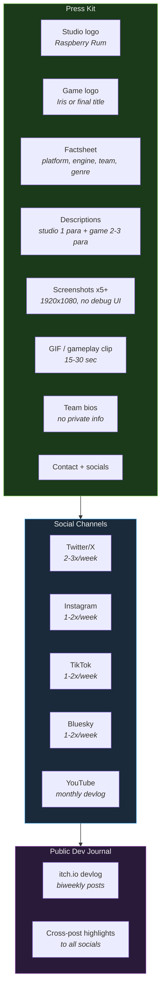

### Content Pillars

| Pillar | Format | Frequency | Example |
|--------|--------|:---------:|---------|
| **Mechanic Spotlights** | GIF / short video | Weekly | Drink pour slow-mo, shoe pairing snap, date reaction bubble |
| **Art Process** | Before/after images | Biweekly | Programmer art → real art, 3D modeling timelapse |
| **Narrative Teasers** | Cryptic text + image | Biweekly | "What happened last night?", wine stain close-up |
| **Indie Dev Life** | Photo / text post | Weekly | Honest updates, wins, struggles |
| **Community Questions** | Poll / question | Weekly | "What would you do on a bad date?" |

### Dev Journal Format (itch.io)

Each biweekly entry follows this structure:

1. **What we built** — 2-3 paragraphs with screenshots
2. **One interesting problem** — technical or design deep dive
3. **What's next** — upcoming sprint goals
4. **Screenshot / GIF of the week**

---

## 9. Steam Store Page

Steam wishlists are the **#1 driver** of indie game visibility at launch. Target: **Coming Soon page live by mid-May 2026**.

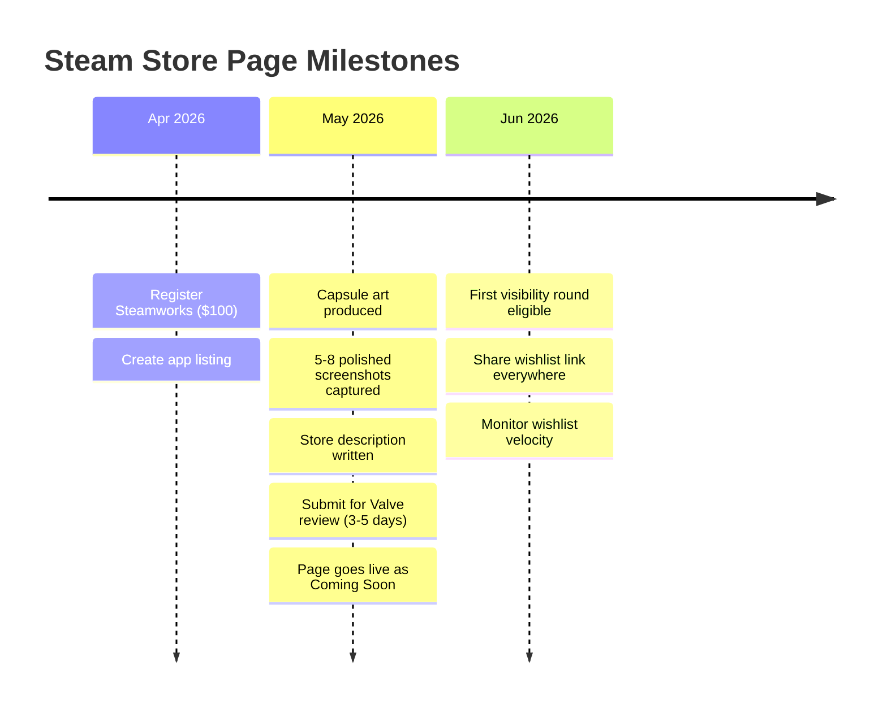

### Store Page Requirements

| Asset | Specs | Status |
|-------|-------|:------:|
| **Header capsule** | 460 x 215 px | Needed |
| **Small capsule** | 231 x 87 px | Needed |
| **Main capsule** | 616 x 353 px | Needed |
| **Library hero** | 3840 x 1240 px | Needed |
| **Library logo** | 600 x 900 px | Needed |
| **Screenshots** | 1920 x 1080, minimum 5 | Needed |
| **Short description** | ~300 characters | Write |
| **Long description** | Rich text, features, story hook | Write |
| **Genre tags** | Simulation, Indie, Horror, Dating Sim, Casual | Define |
| **System requirements** | Based on Unity 6 URP baseline | Define |
| **Trailer** | 30-60 sec minimum (stretch goal) | Stretch |

### Target Tags

| Primary | Secondary |
|---------|-----------|
| Indie | Atmospheric |
| Dating Sim | Dark Humor |
| Horror | Casual |
| Simulation | Story Rich |
| Life Sim | Cozy (subversive) |

---

## 10. Feedback & Playtesting

Feedback collection spans **3 channels**: in-game overlay (built), external forms, and direct playtesting. The in-game system is **already functional** — F8 for playtest feedback, F9 for bug reports, both with Discord webhook integration.

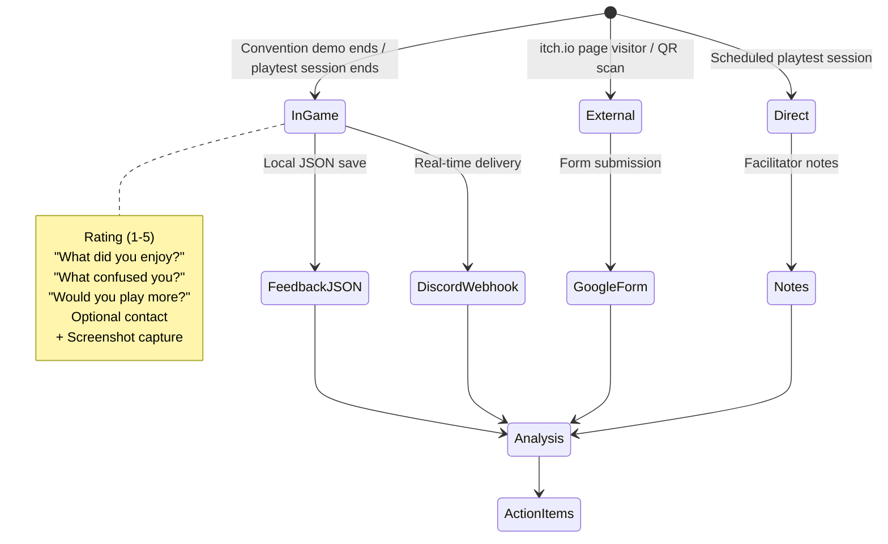

### In-Game Feedback (Built)

| Feature | Implementation | Status |
|---------|---------------|:------:|
| **Playtest Form (F8)** | Rating, free text, optional contact | Working |
| **Bug Report (F9)** | Description, screenshot, game state | Working |
| **Discord Webhooks** | Real-time delivery with JPEG screenshots | Working |
| **Local JSON Backup** | `feedback_<timestamp>.json` | Working |
| **Crash Log Tail** | Appended to bug reports | Working |

### External Channels

| Channel | When | Tool | Purpose |
|---------|------|------|---------|
| Google Form on itch.io | Always | Google Forms | Passive collection from page visitors |
| QR on business card | Events | Google Forms | In-person to digital bridge |
| Discord server | Post-launch | Discord | Community, ongoing feedback, beta coordination |
| Playtest signup | Ongoing | Google Forms → list | Recruit testers, build mailing list |

---

## 11. Risk Analysis

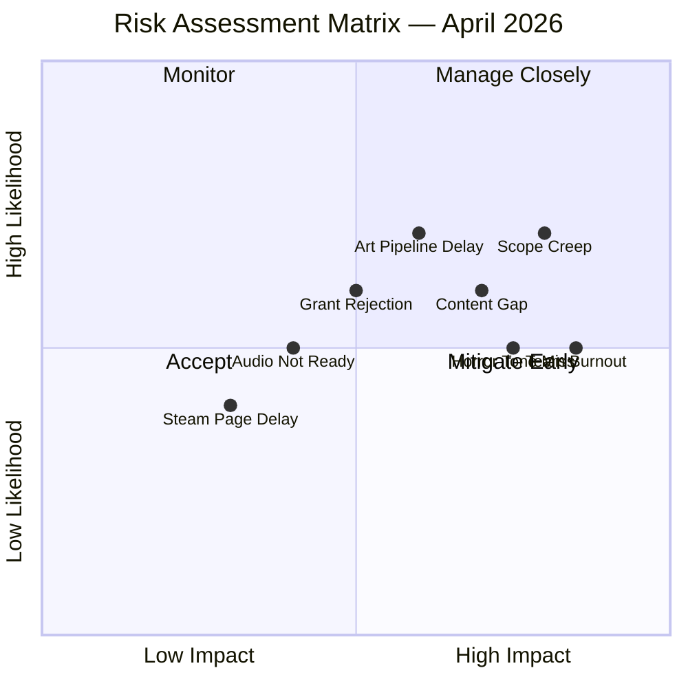

| Risk | Likelihood | Impact | Mitigation |
|------|:----------:|:------:|-----------|
| **Scope creep** (adding features past VS) | High | High | Lock feature list. Only bug fixes + polish until VS complete. |
| **Art pipeline delay** | High | Medium | Programmer art is functional. Art replaces it incrementally — no blockers. |
| **Content gap** (not enough narrative for 7 days) | Medium | High | Write Nema bible first. 4 mess narratives minimum. Prioritize horror payload. |
| **Team burnout** (2-person team, sustained crunch) | Medium | High | Protect weekends. No all-nighters. Ship "good enough" over "perfect." |
| **Horror tone miss** | Medium | Medium | Playtest early with horror-adjacent audience. Iterate on souvenir reveals. |
| **Grant rejection** | Medium | Medium | Apply to **5+ grants** — portfolio approach, don't depend on one. |
| **Audio not ready** | Medium | Low | Systems work silently. Audio is additive, never blocking. 91 clips needed. |
| **Steam page delayed** | Low | Low | Wishlists accumulate slowly at first. May vs. June makes small difference. |

---

## 12. Master Timeline

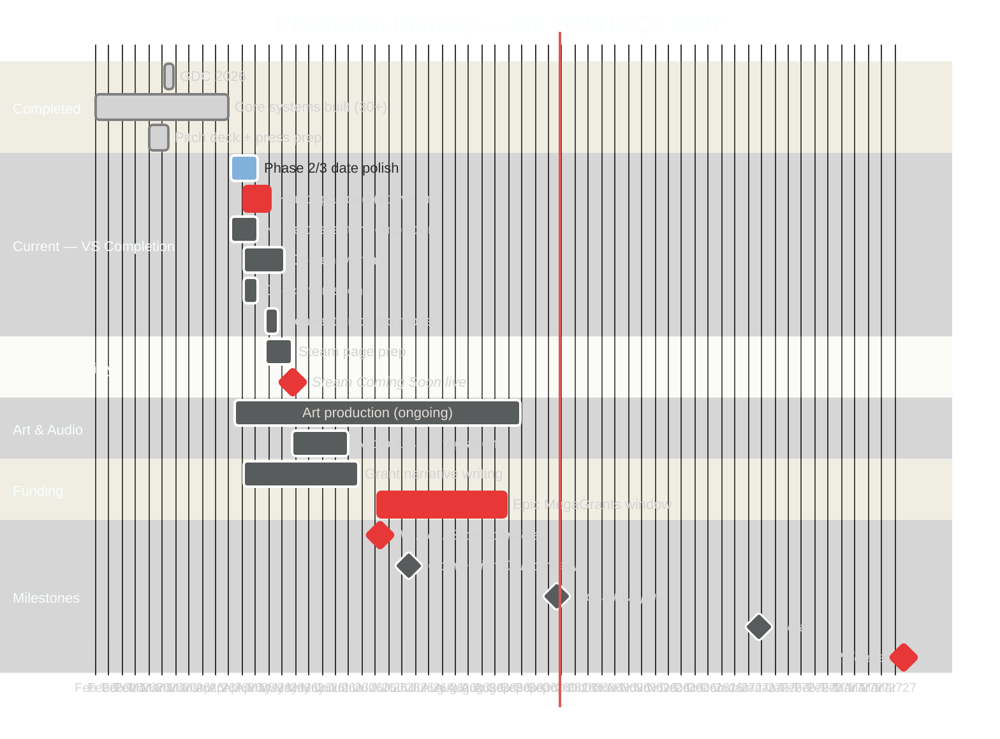

### Weekly Rhythm (Ongoing)

| Day | Focus |
|:---:|-------|
| **Mon** | Sprint planning, priority check, social post |
| **Tue-Thu** | Heads-down production (code / art) |
| **Fri** | Playtest, bug fixes, social post, devlog notes |
| **Weekend** | Content writing (narrative, grants), rest |

---

## Closing

Raspberry Rum has **30+ working systems**, a **clear vertical slice target**, and a **post-GDC foundation** of pitch materials and industry contacts. The prototype is functional and polished — the job now is to **complete the horror payload** (souvenirs, disappearances), **write the narrative content** that gives the game its soul, **polish the date flow** (Phase 2/3 reactions and dialogue), and **get on Steam**. The three remaining critical systems (couch scene, convention demo, horror mechanics) are well-defined and unblocked. Everything after the vertical slice — grants, content alpha, beta, release — flows from the quality of the next 10 weeks of work.

---

*Raspberry Rum — Production Runway v2.0 — April 13, 2026*
